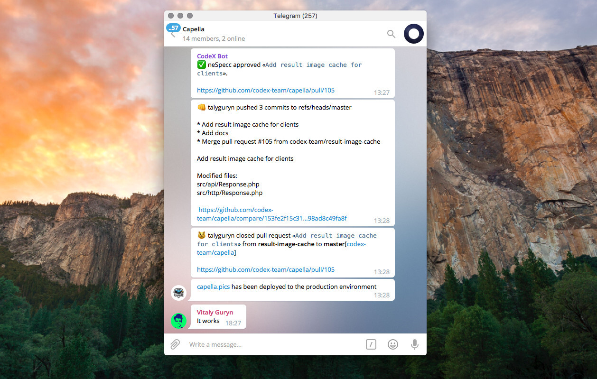
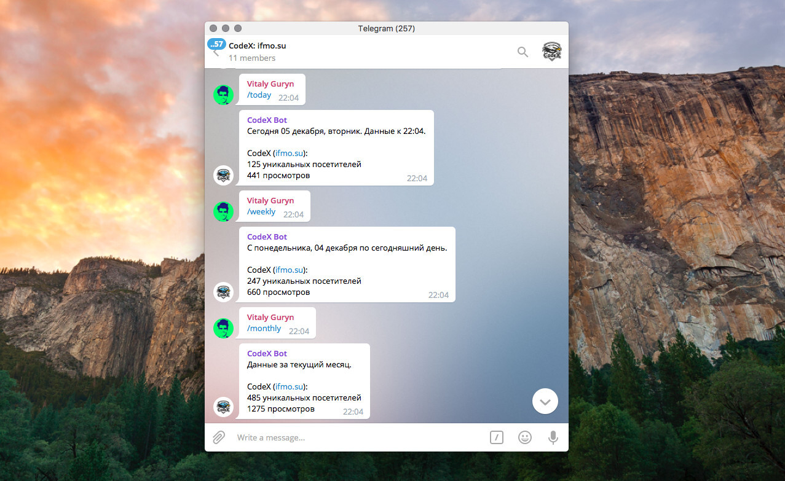

# [@codex_bot](https://codex.so/bot)
Platform for integration of services into messengers. It's simple. Applications written with [our SDK](https://github.com/codex-bot/sdk-python) will be available in all supported messengers.

## Messengers
Currently we support these messengers. We will add several ones soon.

- Telegram
- Slack

## How to use

Add `@codex_bot` in your chat and type `/apps` to view the list of available applications.

### How to create own application

Our [Python SDK](https://github.com/codex-bot/sdk-python) and [Guide for creation an app](https://github.com/codex-team/codex.bot/wiki/Developer's-Guide) will help you.

## Available applications
Everyone can write own application with our SDK. That's what we've got now.

### GitHub
https://github.com/codex-bot/github

Useful integration with github.com. Provides notifications about
- Opened/closed issues
- Assigned issues
- Opened/closed pull requests
- Code reviews
- Branch updates
- Commits

#### Usage
Type `/github_start` and follow instructions to add a new repository.



### Yandex.Metrica
https://github.com/codex-bot/metrika

Get regular or instant reports with analytics data from Yandex.

#### Usage
- `/metrika` — shows application menu
- `/metrika_add` — add new counter
- `/metrika_subscriptions` — setting up a regular daily reports
- `/metrika_stop` — disable counter
- `/metrika_counters` — list of added counters
- `/metrika_access` — remove user from the chat



### Webhooks
https://github.com/codex-bot/Webhooks

Easy-to-setup notifications scheme. You will get a special link that allows to send messages via simple POST requests.

#### Usage
- `/notify_start` — get webhook URL for sending messages to the chat
- Send POST request for the given URL with `message` field

Example:
```bash
curl -X POST https://notify.bot.codex.so/u/ABCD1234 -d "message=Hello world"
```


### RSS Parser
https://github.com/codex-bot/rssparser

Subscribe to your favorite feeds and get notifications with updates.

#### Usage
- `/rssparser` — help message with a list of commands
- `/rssparser_list` — show a list of your subscriptions
- `/rssparser_add <URL>` — subscribe to the feed
- `/rssparser_get` — check your feed for updates
- `/rssparser_remove <URL>` — unsubscribe from the feed


### Weather
https://github.com/codex-bot/weather

Allows you to be informed about weather conditions in your region via Telegram chat.

#### Usage
- `/city <CITY_ID>` — setting up your location
- `/cities` — view cities list
- `/weather` — get current weather conditions


## Issues and improvements

- Ask a question or report a bug on the [create issue page](https://github.com/codex-team/codex.bot/issues/new).
- Know how to improve the platform? [Fork it](https://github.com/codex-team/codex.bot) and send a pull request.

## About CodeX

We are a small team of passionate web-developers represented by students and graduates of ITMO University located in St. Petersburg, Russia. Fell free to give us a feedback on  [team@codex.so](mailto:team@codex.so)
